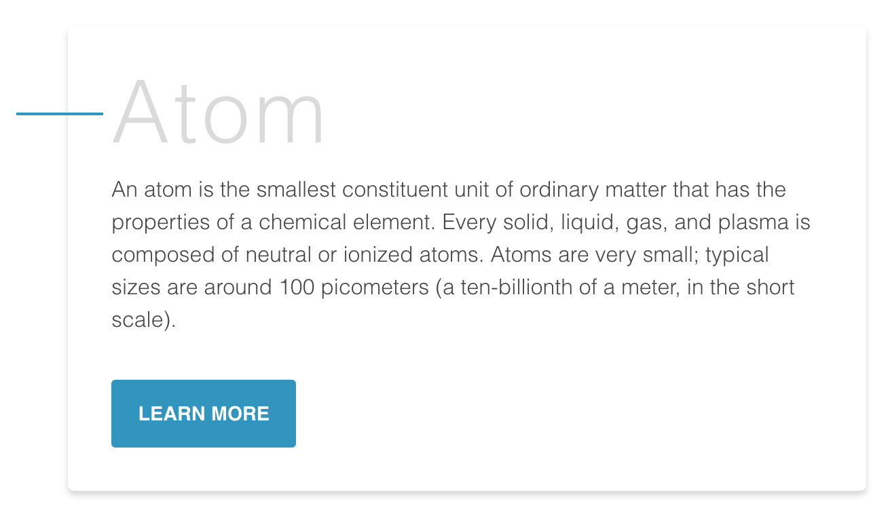
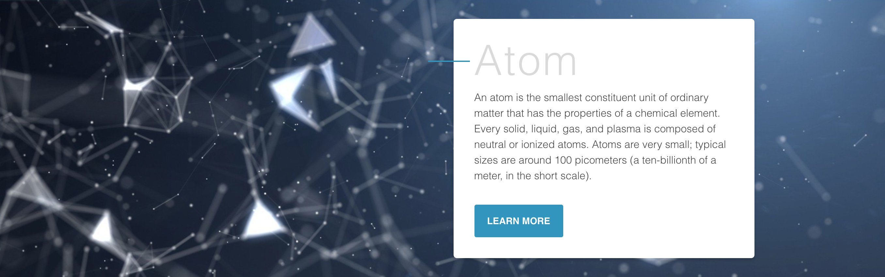
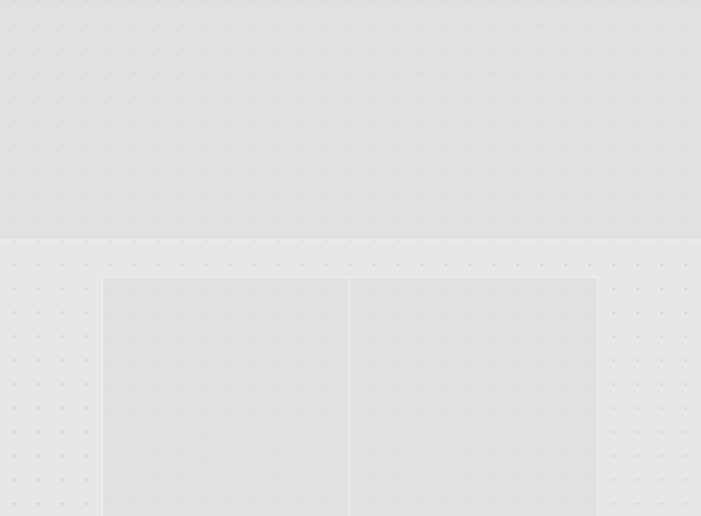
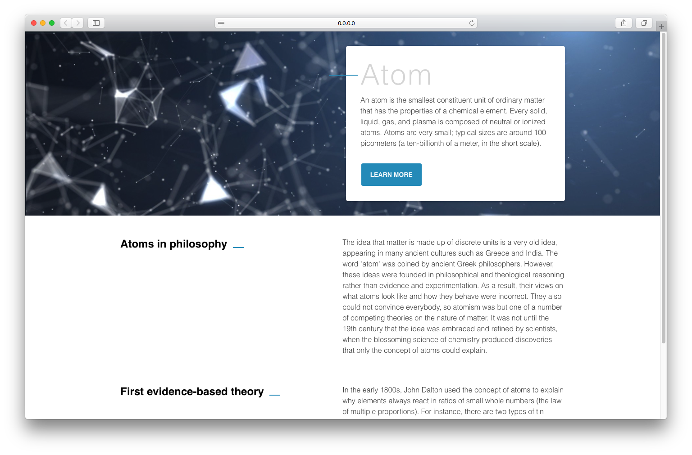

# Atomic

# 紹介

React 開発を行ってる皆様、こんにちは 😀

この文書は React の設計に関しての文書です。

# Atomic Design とは？

Atomic Design はデザイン分野で有名な**頑固な、不変の、再使用可能なデザインシステム**のことを言います。

React 開発においては（Vue など他の Framework を含め）Component という特徴の中で意識的にも無意識的にも Atomic design が溶け込んでいます。

Atomic design の発想は化学からきております。物質が構成されている観点から Web page を次のように見なしています。

```
atoms - molcules - organisms - templates - pages
```

# Atom


```javascript
const Button = ({ type = 'button', children = '' }) => (
  <button type={type}>{children}</button>
)

const Input = ({ type = 'text', id = '' }) => (
  <input type={type} id={id} />
)

const Label = ({ for = '', children = '' }) => (
  <label htmlFor={for}>{children}</label>
)
```

Atom はできる限り一番小さい Component のことをいいます。例として button, title, input, event color pallets, animations, font などがあります。これらをどんな Context でも、例えば Global もしくは他の Componet の中、使うことができます。

# Molcule



```javascript
import { Button, Input } from 'atoms'

const SearchForm = () => (
  <div>
    <Input />
    <Button type={submit}> Search </Button>
  </div>
)

import { Label, Input } from 'atoms'

const FormLabel = () => (
  <div>
    <Label for='form_test'>test</Label>
    <Input id='form_test' />
  </div>
)
```

Molcule は 1 個もしくは 1 個以上の Atom の集合です。ここから我々は複雑な Component の設計を行います。Molcule はそれなりの関数や Action を持つことはないですが、なかの Atom を使い Property、Function をつけることをします。

# Organism



Organism はまた Molcule の集合。もっと巧みのある Interface となります。この時点で Component は Final 的な模様を持ちますが、まだ独立した Component であり、どんな Context でも使うことができるようにするのが大切です。

# Template



Template はまた別の領域かもしれません。Template は Component 作成ではなく、Component の文脈(Context)を考えます。Organisms の関係や、配置、位置、整列、パターンなどを考慮するところでなんの Style、Color ももちません。

# Page



最終的に Template 内で構成された Component により Page が生まれます。この段階で Design システムの効率確認、分析などを行います。各要素が十分に独立性を持っているか、もっと小さく分解できるかなどを考慮します。

---

# React において Atomic design

> Component が再使用可能なのか

React で Atomic design を用いる時の根本的な概念です。

1. atom は`margin`, `position`を持たない。
2. molcule, organism だけが atom の`position`を決めることができる。ただし、これ自体は`position`などをもたない。
3. template は page の grid のみの機能をする。Component の位置などを決めてはいけない。
4. Page は template が規定した範囲ないで Render する。

# file directory

```
src - assets
    - components
        - HOC
        - pages
        - templates
        - UI
            - organisms
            - molcules
            - atoms
    - config
    - styles
```

# Features

**Dir の積み重ねに注意**. 3~4 nest までを目安にしましょう。

- Relative path `import` は Jest,WebPack、Babel などの `alias` で簡略化することができます。
